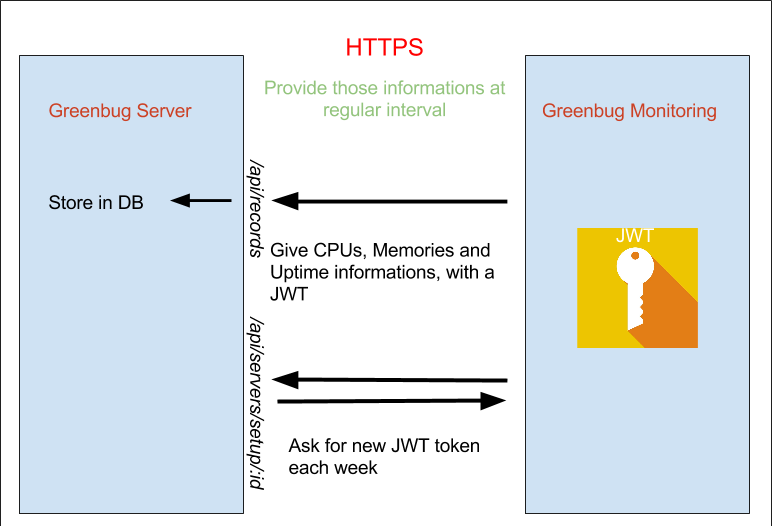

# greenbug-monitoring
A software to send informations of a server to a Greenbug server. The aim is to do some monitoring.

## Configuration example

```json
{
  "id": 1,
  "url": "https://example-adress.com",
  "password": "1FkMtEBySLPxcDL1u3CwexxaEc9lFwiWbUOExhSq8hFjmf26YHh0771BOFghXVpj",
  "local_server_urls": [
    "http://localhost/index.html",
    "http://localhost/account.html"
  ]
}
```
_The authentication informations will be automatically given by the Web UI of Greenbug._

## Interaction with Greenbug Server

